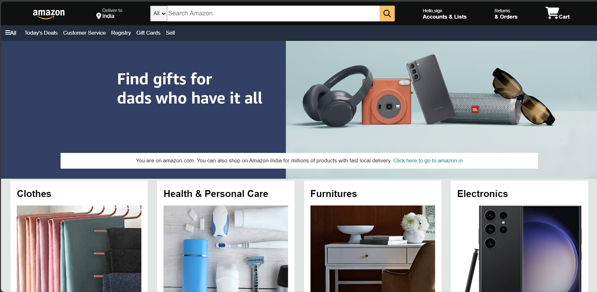

# Amazon-Clone
A simple frontend Amazon clone built using HTML &amp; CSS. It features a hero section, product boxes, navigation bar, and footer, replicating Amazon's homepage design. This project is for learning purposes and does not include backend functionality. Feel free to explore and improve! 🚀

# 🛒 Amazon Clone

A simple frontend Amazon clone built using **HTML & CSS**. This project replicates the homepage design of Amazon, featuring:

✅ A **hero section**  
✅ **Product boxes**  
✅ **Navigation bar**  
✅ **Footer section**  

🚀 **Live Demo:** [Amazon Clone](https://rohithdannana156.github.io/Amazon-Clone/)

---

## 📂 Project Structure
📁 Amazon-Clone  
├── **index.html** → Main HTML file  
├── **style.css** → Stylesheet  
├── **images/** → All images used in the project  
├── **README.md** → Project documentation  
└── other files...  


---

## 📸 Preview



---

## ⚙️ Technologies Used

- **HTML5**  
- **CSS3**  
- **Font Awesome** (for icons)  

---

## 🛠️ Setup Instructions

1️⃣ Clone the repository:
```sh
git clone https://github.com/rohithdannana156/Amazon-Clone.git

2️⃣ Open index.html in your browser.

🌟 Features
✔️ Responsive design
✔️ Amazon-style product boxes
✔️ Mobile-friendly layout

📌 Contributing
Feel free to contribute! Fork the repository and submit a pull request.

📜 License
This project is for educational purposes only and is not affiliated with Amazon.


---

### ✅ **Next Steps:**
1. **Create or update** `README.md` in your repository.
2. **Paste** the above content.
3. **Commit and push** your changes.

This will make your project look **more professional** on GitHub! 🚀 Let me know if you need any modifications. 😊
